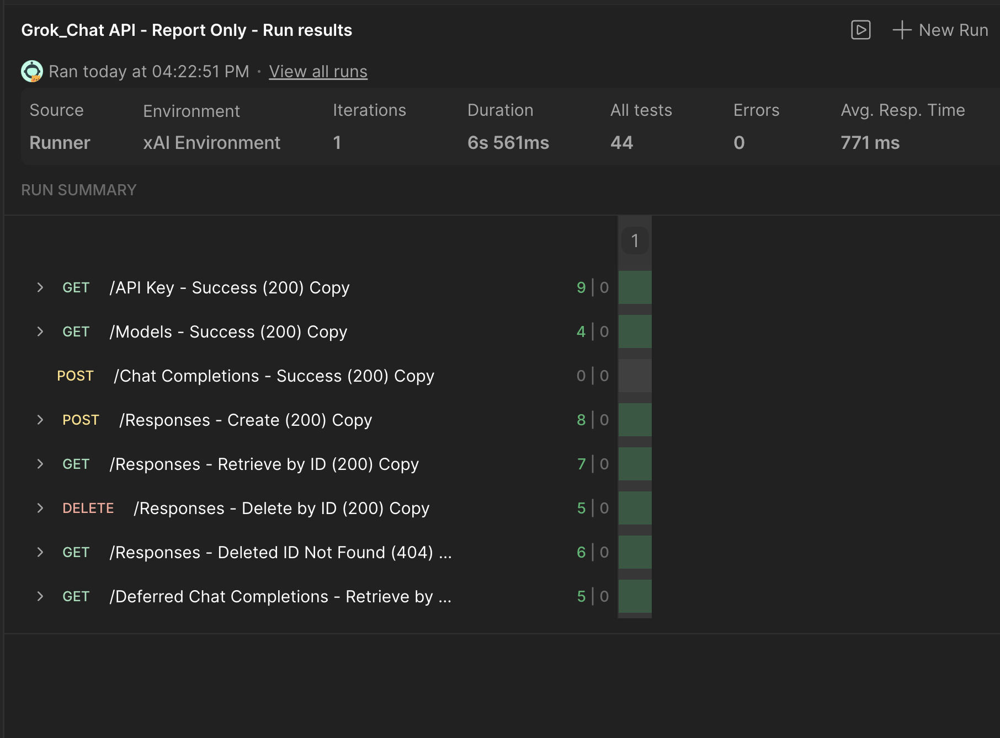
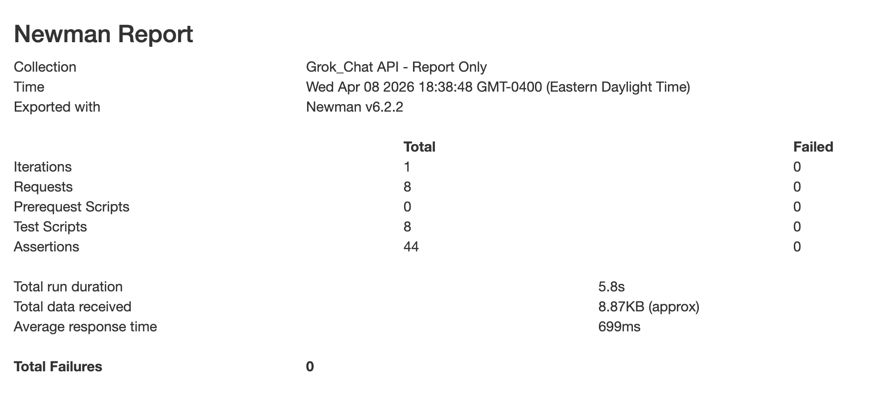
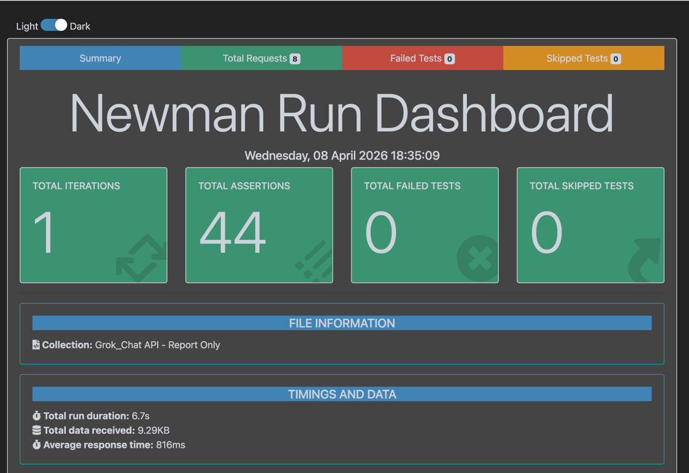

# Grok Chat API Testing

> Automated API testing using Postman + Newman

---

## Features
- API testing with Postman
- Automated runs with Newman
- Request chaining (dynamic variables)
- Response validation (status, body, headers)
- Basic performance checks

---

## Coverage
- Status codes
- Response time & size
- JSON structure validation
- Headers validation
- Negative testing (404 after delete)

---

## Endpoints
- `GET /v1/api-key`
- `GET /v1/models`
- `POST /v1/chat/completions`
- `GET /v1/chat/deferred-completion/{{requestId}}`
- `POST /v1/responses`
- `GET /v1/responses/{{responseId}}`
- `DELETE /v1/responses/{{responseId}}`

---

## Results
✔ 44 tests passed  
✔ 0 failures  


---

## Run
### Postman Run Report

### Simple HTML Newman Report

### Newman Run Report


```bash
newman run collections/Grok_Chat_API.postman_collection.json \
-e environments/Grok_Chat_API.postman_environment.template.json \
-r cli,htmlextra
