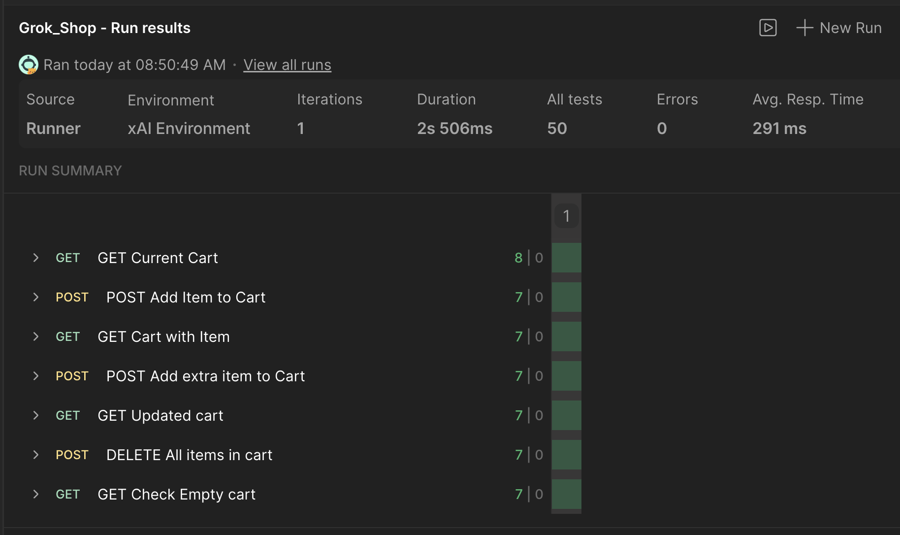
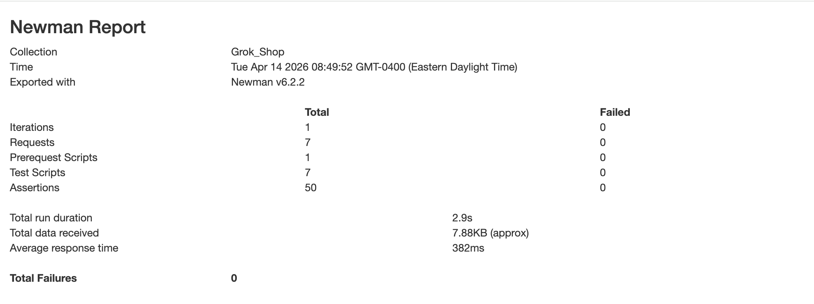
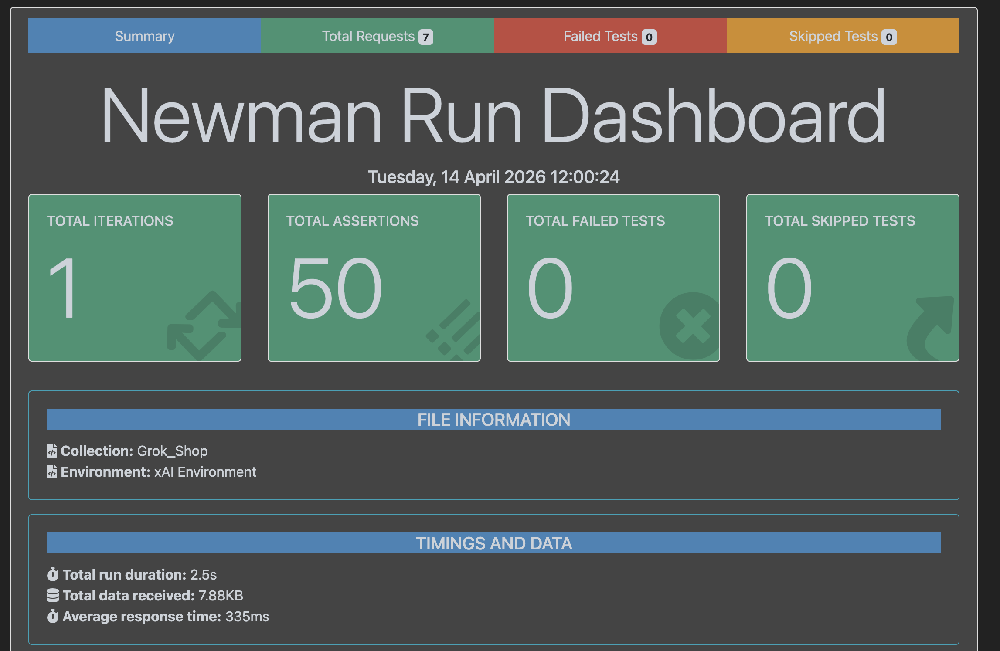

# Grok Shop API Testing

> Automated API testing using Postman + Newman

---

## Features
- API testing with Postman
- Automated runs with Newman
- Request chaining
- Response validation (status, body, headers)
- Basic performance checks
- Cart workflow testing

---

## Coverage
- Status codes
- Response time & size
- JSON structure validation
- Headers validation
- Cart state validation
- Add item to cart
- Add extra item to cart
- Clear cart
- Empty cart check

---

## Endpoints
- `GET /cart.js`
- `POST /cart/add.js`
- `POST /cart/clear.js`

---

## Results
✔ 50 tests passed  
✔ 0 failures  

---

## Run Summary
- **Iterations:** 1
- **Requests:** 7
- **Prerequest Scripts:** 1
- **Test Scripts:** 7
- **Assertions:** 50
- **Average response time:** 382 ms
- **Total run duration:** 2.9 s
- **Total data received:** 7.88 KB
- **Failed iterations:** 0

---

## Requests Tested

### 1. GET Current Cart
- Status: `200`
- Checks:
  - Environment is clean before tests
  - Response time is less than 1000 ms
  - Response size is less than 1000 bytes
  - Response body is JSON object
  - Response body contains main keys
  - `item_count` is `0`
  - `Content-Type` includes `text/javascript`

### 2. POST Add Item to Cart
- Status: `200`
- Checks:
  - Response time is less than 1000 ms
  - Response size is less than 2000 bytes
  - Response body is JSON object
  - Response body contains valid numeric id
  - `quantity` is greater than `0`
  - `Content-Type` includes `text/javascript`

### 3. GET Cart with Item
- Status: `200`
- Checks:
  - Response time is less than 1000 ms
  - Response size is less than 2000 bytes
  - Response body is JSON object
  - Response body contains main keys
  - Cart has item
  - `Content-Type` includes `text/javascript`

### 4. POST Add Extra Item to Cart
- Status: `200`
- Checks:
  - Response time is less than 1000 ms
  - Response size is less than 2000 bytes
  - Response body is JSON object
  - Response body contains valid numeric id
  - `quantity` is greater than `0`
  - `Content-Type` includes `text/javascript`

### 5. GET Updated Cart
- Status: `200`
- Checks:
  - Response time is less than 1000 ms
  - Response size is less than 2000 bytes
  - Response body is JSON object
  - Response body contains main keys
  - Cart has more than 1 item
  - `Content-Type` includes `text/javascript`

### 6. POST Clear Cart
- Status: `200`
- Checks:
  - Response time is less than 1000 ms
  - Response size is less than 1000 bytes
  - Response body is JSON object
  - Response body contains main keys
  - `item_count` is `0`
  - `Content-Type` includes `text/javascript`

### 7. GET Check Empty Cart
- Status: `200`
- Checks:
  - Response time is less than 1000 ms
  - Response size is less than 1000 bytes
  - Response body is JSON object
  - Response body contains main keys
  - Cart is empty
  - `Content-Type` includes `text/javascript`

---

## Run
### Postman Run Report

### Simple HTML Newman Report
![img_1.png](img_1.png)

### Newman Run Report
![img.png](img.png)

```bash
newman run collections/Grok_Shop.postman_collection.json \
-e environments/Grok_Shop.postman_environment.json \
-r cli,htmlextra